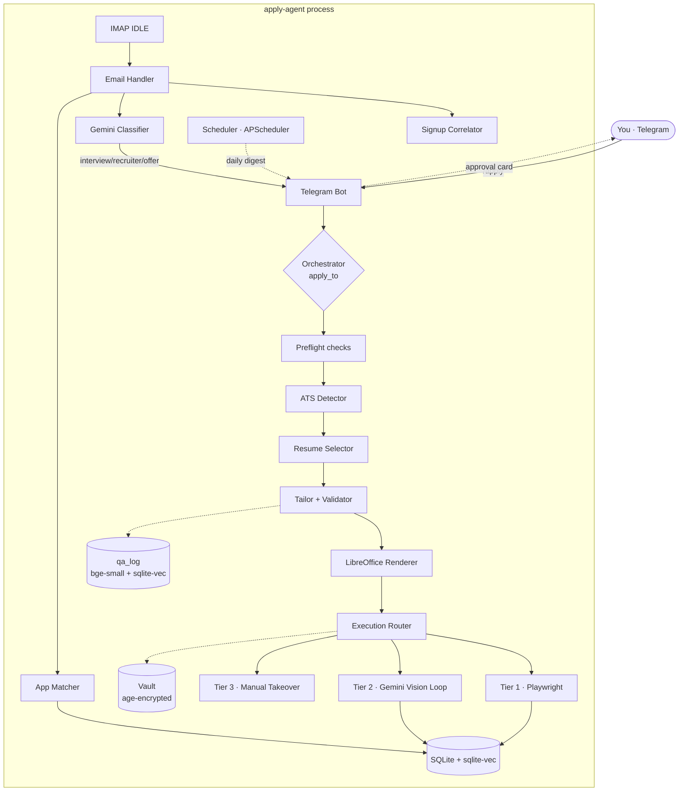

# Architecture

## Process layout

`apply-agent` is a single Python process. All subsystems run in one event loop. Subsystems with no credentials configured disable themselves and emit a startup warning — the rest of the agent runs.



## Module boundaries

```
src/
├── main.py                  # entrypoint, flag parsing, loop wiring
├── config.py                # env vars + paths + Settings dataclass
│
├── orchestrator/
│   ├── pipeline.py          # apply_to(url) end-to-end
│   └── preflight.py         # window, cap, cooldown, salary, sponsor
│
├── profile/
│   ├── schema.py            # pydantic models for profile.yaml
│   ├── loader.py            # age decryption + YAML parse
│   └── qa_log.py            # store/lookup with bge-small embeddings
│
├── resume/
│   ├── source.py            # READ-ONLY .md/.docx reader
│   ├── selector.py          # two-stage: family routing + cosine
│   ├── embeddings.py        # bge-small-en-v1.5 lazy load
│   ├── tailor.py            # Gemini Flash + 2-retry loop
│   ├── validator.py         # sacred entity-based validator
│   └── renderer.py          # md → docx (python-docx) → pdf (libreoffice)
│
├── ats/
│   ├── base.py              # ATSAdapter ABC, ParsedJob, ApplicationPlan
│   ├── detector.py          # URL → ATS + tier routing
│   ├── greenhouse.py        # Tier-1
│   ├── lever.py             # Tier-1
│   ├── ashby.py             # Tier-1
│   ├── workable.py          # Tier-1
│   ├── smartrecruiters.py   # Tier-1
│   └── llm_fallback.py      # Tier-2 task builder
│
├── execution/
│   ├── router.py            # run_application() picks tier
│   ├── tier1_playwright.py
│   ├── tier2_browseruse.py  # vision-driven loop, JSON action grammar
│   └── tier3_handoff.py     # screenshot + Telegram alert
│
├── browser/
│   ├── harness.py           # Playwright persistent context, jitter
│   ├── fingerprint.py       # stealth init script
│   └── handoff.py           # stuck_guard async context manager
│
├── accounts/
│   ├── signup.py            # ensure_account end-to-end
│   ├── vault.py             # per-row age encryption + CSV mirror
│   └── password_gen.py      # 24-char CSPRNG
│
├── llm/
│   ├── client.py            # Gemini wrapper, rate-limited
│   ├── rate_limiter.py      # 15 RPM / 1500 RPD bucket
│   └── prompts/
│       └── tailor.py
│
├── telegram_bot/
│   ├── bot.py               # /apply /pending /status /done /profile etc.
│   ├── handlers.py          # /ping
│   ├── cards.py             # approval / pause / response / status
│   └── allowlist.py         # chat_id gate
│
├── email_monitor/
│   ├── imap_idle.py         # IDLE loop, worker thread bridge
│   ├── signup_correlator.py # match verify/2fa to expectations
│   ├── classifier.py        # Gemini classifier into 6 categories
│   ├── matcher.py           # email → application row
│   └── handler.py           # top-level on_message
│
├── company_research/
│   └── scraper.py           # httpx + selectolax
│
├── linkedin/
│   ├── session.py           # reuse storage_state.json
│   ├── referral_scan.py     # 1st-degree connection scan
│   ├── dm_drafter.py        # Gemini drafts DM, user pastes
│   └── easy_apply.py        # TIER-3 ONLY, never automated
│
├── db/
│   ├── models.py            # SQLAlchemy models, all §5 tables
│   ├── session.py           # engine + sqlite-vec extension load
│   └── migrations/          # Alembic
│
└── observability/
    ├── rate_tracker.py      # per-variant response-rate
    ├── digest.py            # daily 7pm-local summary
    └── scheduler.py         # APScheduler CronTrigger
```

## Data flow: one application

```
1. /apply <url>          (Telegram)
2. route(url) → Detection(ats=greenhouse, tier=tier1)
3. AdapterCls = adapter_for(detection) → GreenhouseAdapter
4. browser_session(headless=False):
     job = await adapter.parse_job(page, url)
5. preflight_all(job) → PreflightDecision.passing()
6. company_facts = await fetch_company(...)
7. choice = select(job.description_md, jd_embedding=embed(jd), embed_fn=embed)
8. tr = await tailor(jd, source, company, role, client)
     ├── client.generate(prompt, temperature=0.2)
     ├── validate(tailored, source) → ok=True
     └── (or retry with feedback, else escalate)
9. rendered = render(tr.tailored_md, variant=..., company=..., role=...)
     ├── md → docx via python-docx
     └── docx → pdf via libreoffice headless (UUID stamped)
10. plan = _build_plan(profile, rendered.pdf_path, company_facts, job)
11. INSERT applications row (status='tailored')
12. telegram.send_approval(approval_card(...))
13. approved = await telegram.wait_for_approval(app_id, timeout=600)
14. if approved:
      await adapter.fill(page, plan, dry_run=settings.dry_run)
      if not dry_run:
        applications.applied_at = now
        applications.status = 'submitted'
      screenshot → data/screenshots/
```

## Data flow: one response email

```
1. IMAP IDLE yields a new UNSEEN message
2. on_message(msg):
     a. match_and_fulfill(msg) — is it a signup verify? → done, return
     b. cls = await classify(msg) → Classification(category='interview_invite', ...)
     c. app = match(msg) — sender domain ↔ company, then fuzzy subject/body
     d. INSERT response_log row
     e. if cls.category in HIGH_PRIORITY:
          await _alert(telegram, app, msg, cls)
          mark response_log.notified = True
     else:
          silent log; will appear in daily digest
```

## Concurrency model

- One asyncio event loop.
- IMAP IDLE runs on a worker thread (`asyncio.to_thread`); it bridges back via `run_coroutine_threadsafe`.
- APScheduler uses `AsyncIOScheduler`; jobs run on the same loop.
- `/apply` spawns a background `asyncio.Task` so the bot stays responsive during a 60-90s tailor + fill.
- Telegram approvals use an `asyncio.Future` keyed by `application_id`, resolved by the callback handler.

## Where state lives

| State | Where |
|---|---|
| Encrypted profile | `secrets/profile.yaml.age` |
| Master encryption key | `secrets/master.age.key` (back this up!) |
| Vault | `apply_agent.db:portal_credentials` (per-row `age` ciphertext) |
| CSV mirror | `secrets/portal_passwords.csv` (one-way export) |
| Applications | `apply_agent.db:applications` |
| Q&A semantic store | `apply_agent.db:qa_log` (with `bge-small` blob embeddings) |
| Resume embeddings cache | `apply_agent.db:resume_embeddings` |
| Email expectations | `apply_agent.db:email_expectations` |
| Response log | `apply_agent.db:response_log` |
| HITL training runs | `apply_agent.db:training_runs` |
| H1B sponsor data | `apply_agent.db:sponsors_h1b` |
| Tailored PDFs | `data/tailored/<uuid>__<variant>__<company>__<role>.pdf` |
| Screenshots | `data/screenshots/<app_id>_<uuid>.png` |
| Browser profile | `chrome-profile-apply/` |
| Logs | stdout (run via `make run`); pipe to a file if you want |

Everything under `secrets/`, `data/`, and `chrome-profile-apply/` is gitignored.
